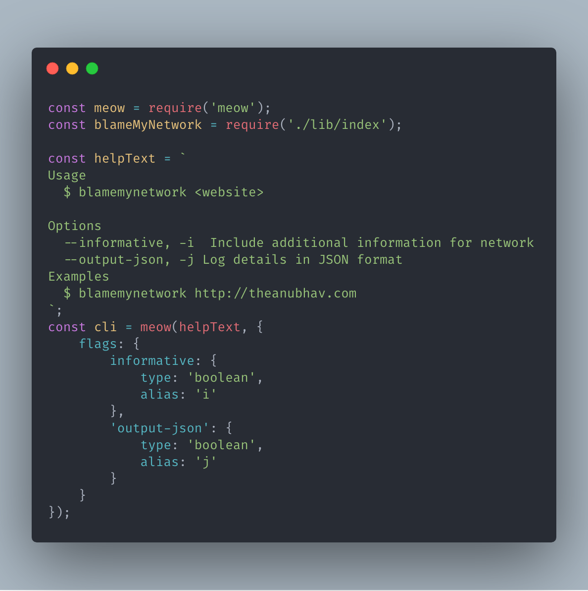

This is a series of libraries and utilities for building Command-line-interfaces aka CLI using Node.js and ecosystem around it. Similar utilities/helpers may be available for other languages but, these series is focused on JavaScript and its friends.

You can check all articles under [`CLI Build Tool`](/category/cli-build-tool/) tag.

## [meow](https://github.com/sindresorhus/meow)

If you are building a CLI that has some command line options (args e.g --version), sometimes mandatory and usually optional, `meow` is the library you should be banking on. Built by sindresorhus, which adds a lot of credibility to this library, is nearly used by 1.5+ million other packages.

`meow` is the easiest way to write command line apps with arguments for Node.js.

### Default arg parsing

You do not need to worry about `process.argv` and everything around it. `meow` takes care of arguments and it casing (By default converts to CamelCase).

### Default support for `--help` and `--version`

It provides support for showing CLI options as help to user and also version of your app from `package.json` file. No extra handling is required

### Support for alias and descriptions

You can add alias for long argument options, like --help can be -h.

All flags and values are available in meow instance, which can be used by the CLI for acting on it.

You can check out official [repo](https://github.com/sindresorhus/meow) for all usage details.

Github Repo: [meow](https://github.com/sindresorhus/meow)

## <!-- other module yargs -->
