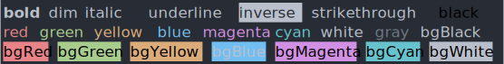

This is a series of libraries and utilities for building Command-line-interfaces aka CLI using Node.js and ecosystem around it. Similar utilities/helpers may be available for other languages but, these series is focused on JavaScript and its friends.

You can check all articles under [`CLI Build Tool`](/category/cli-build-tool/) tag.

## [chalk](https://github.com/chalk/chalk)

If you are building a CLI that done some good amount of console logs, i.e, logging on the terminal, you would want it to be more user friendly and be able to differentiate between various message. Constantly adding logged messages means that the most important messages can get lost in the shuffle. `Chalk` is here to solve that, Terminal string styling done right!

With 256 and Truecolor color support, it also offers various modifiers like 'strikethrough', 'underline', 'italic', etc . It can also set background color for individual strings.



Chalk has a very easy to follow, simple to use API. Chalk comes with composable API where you just chain and nest the styles you want. Here are a few code examples:

```javascript
const chalk = require('chalk');

// style a string
chalk.blue('Hello world!');

// styled and normal strings
chalk.blue('Hello') + 'World' + chalk.red('!');

//  chainable API
chalk.blue.bgRed.bold('Hello world!');

// multiple arguments
chalk.blue('Hello', 'World!', 'Foo', 'bar', 'biz', 'baz');

// nest styles
chalk.red('Hello', chalk.underline.bgBlue('world') + '!');
```

With ES6 Tagged Template usage, API seems to be very simple, e.g,

```javascript
const chalk = require('chalk');

const miles = 18;
const calculateFeet = miles => miles * 5280;

console.log(chalk`
  There are {bold 5280 feet} in a mile.
  In {bold ${miles} miles}, there are {green.bold ${calculateFeet(miles)} feet}.
`);
```

You can check out official [repo](https://github.com/chalk/chalk) for all usage details.

Github Repo: [Chalk](https://github.com/chalk/chalk)

---
