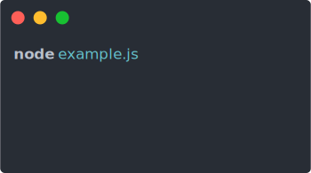

This is a series of libraries and utilities for building Command-line-interfaces aka CLI using Node.js and ecosystem around it. Similar utilities/helpers may be available for other languages but, these series is focused on JavaScript and its friends.

You can check all articles under [`CLI Build Tool`](/category/cli-build-tool/) tag.

## [ora](https://github.com/sindresorhus/ora)

If you are building a CLI and need to compute or make a network call, or basically anything that is gonna take some time, you should let the user know about it. The best way on the web would be to show spinner, loader, throbber. Remember Youtube buffering symbol? `ORA` helps to do the same on the Terminal!

If you were to just `console.log()` each character in the aforementioned animation, you’d end up with something like this:

```bash
- working...
\ working...
| working...
/ working...
- working...
\ working...
```

Ora to the Rescue!



You can update the spinner on the go, changing its color, text, spinner, indent, etc. It also has a way to change the loader (per frame) or you can simply choose from plenty of [prebuilt spinners](https://github.com/sindresorhus/cli-spinners/blob/master/spinners.json).

ORA has a very easy to follow, simple to use API. Here is a code example:

```javascript
const ora = require('ora');

const spinner = ora('Loading unicorns').start();

setTimeout(() => {
	spinner.color = 'yellow';
	spinner.text = 'Loading rainbows';
}, 1000);
```

Now you’re only limited by your imagination… and/or available emojis! 🛴

You can check out official [repo](https://github.com/sindresorhus/ora) for all usage details.

Github Repo: [ora](https://github.com/sindresorhus/ora)

### Related

-   Check [progress-string](/posts/cli-progress-string) for showing progress bar in terminal

---
