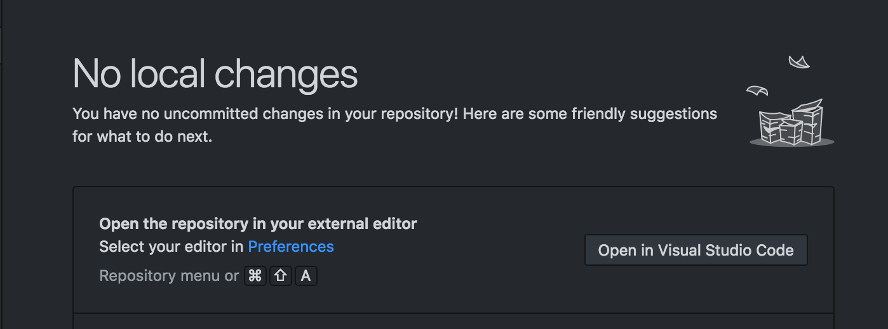

This is a series of libraries and utilities for building Command-line-interfaces aka CLI using Node.js and ecosystem around it. Similar utilities/helpers may be available for other languages but, these series is focused on JavaScript and its friends.

You can check all articles under [`CLI Build Tool`](/category/cli-build-tool/) tag.

## [open](https://github.com/sindresorhus/open)

If you are building a CLI and need to open a file in external application or a URL in a browser, `open` is the package you need. The best part is, it is cross-platform. You can open stuff like URLs, files, executable(s) (across platforms), it also claims to be safer as it uses 'spawn' instead of 'exec'.

You may have seen option to open your repository folder in your IDE, in Github Desktop App (Electron based). You can achieve such functionality using 'open'

"Open in Visual Studio Code" option in Github Desktop App.


`open` has a very easy to follow, simple to use API. Here is a code example:

```javascript
const open = require('open');

// Opens the image in the default image viewer
open('unicorn.png', { wait: true }); //wait option will wait for app to close
console.log('The image viewer app closed');

// Opens the url in the default browser
open('https://sindresorhus.com');

// Specify the app to open in
open('https://sindresorhus.com', { app: 'firefox' });

// Specify app arguments
open('https://sindresorhus.com', { app: ['google chrome', '--incognito'] });
```

You can check out official [repo](https://github.com/sindresorhus/open) for all usage details.

Github Repo: [open](https://github.com/sindresorhus/open)

### Related

-   Check [open-cli](https://github.com/sindresorhus/open-cli) - CLI version for this module

---
