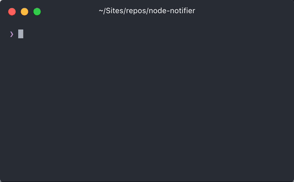

This is a series of libraries and utilities for building Command-line-interfaces aka CLI using Node.js and ecosystem around it. Similar utilities/helpers may be available for other languages but, these series is focused on JavaScript and its friends.

You can check all articles under [`CLI Build Tool`](/category/cli-build-tool/) tag.

## [node-notifier](https://github.com/mikaelbr/node-notifier)

If you are building a CLI and need to show notification to user to make your CLI more interactive and user friendly, `node-notifier` is the package you need. Of course, it is cross-platform and you can send notifications on native Mac, Windows and Linux.

_on Mac_


_on Windows_


For instance, if your CLI watches a file (like `chowkidar`) and takes an action (like restarting a service or rebuilding your project), you can notify using system notifications along with CLI output.

Input Example macOS Notification Center


`node-notifier` has a very easy to follow, simple to use API. Here is a code example:

```javascript
const notifier = require('node-notifier');
// String
notifier.notify('Message');

// Object
notifier.notify({
	title: 'My notification',
	message: 'Hello, there!'
});
```

There are a lot of conditions and scenarios for cross platform implementation of this module.
You can check out official [repo](https://github.com/mikaelbr/node-notifier) for all usage details.

Github Repo: [node-notifier](https://github.com/mikaelbr/node-notifier)

### Related

-   Check [node-notifier-cli](https://github.com/mikaelbr/node-notifier-cli) - CLI version for this module

---
