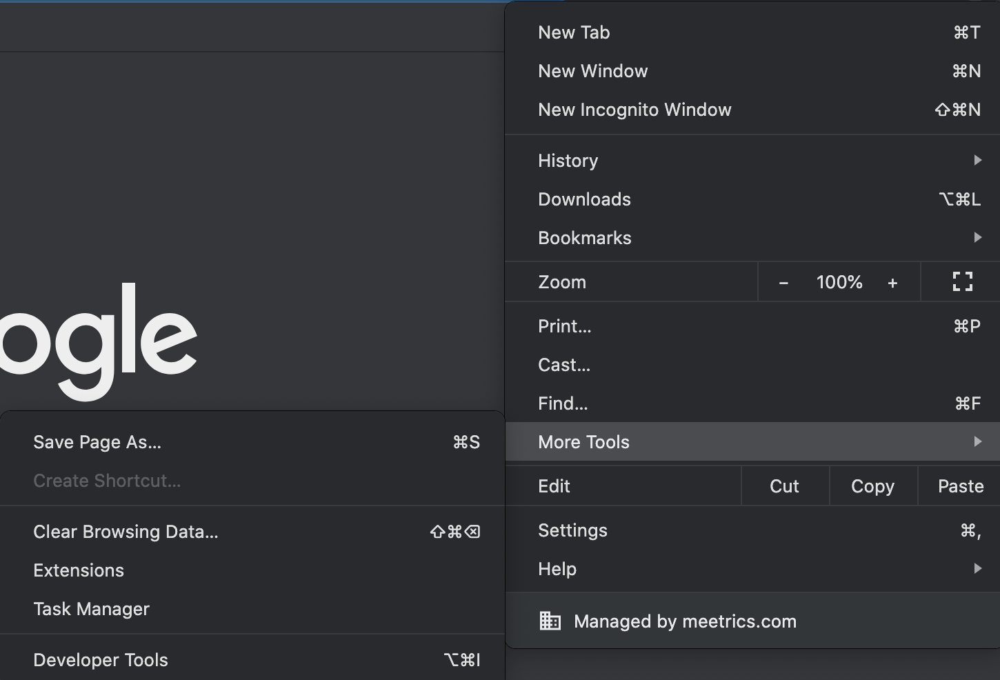
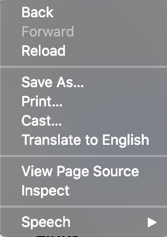

There are few  ways to open DevTools, based on preference, one may get used to one of their choice.

### Using Mouse (by right click)

You can also open Chrome DevTools from the right click menu. Right click anywhere on page and then click `Inspect Element`.

### From Browser menu

You can open Chrome DevTools from the Chrome menu. Go to `More Tools` and then click `Developer Tools`.

### Using Keyboard shortcut

You can use keyboard shortcut to open it up,

Mac: `Cmd + Opt + I`
Windows: `F12` or `Ctrl + Shift + I`

---

