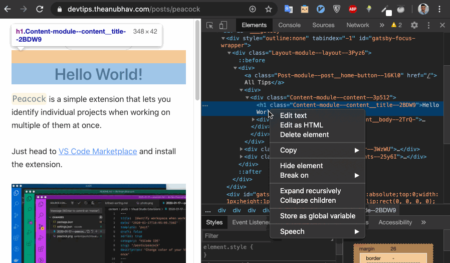
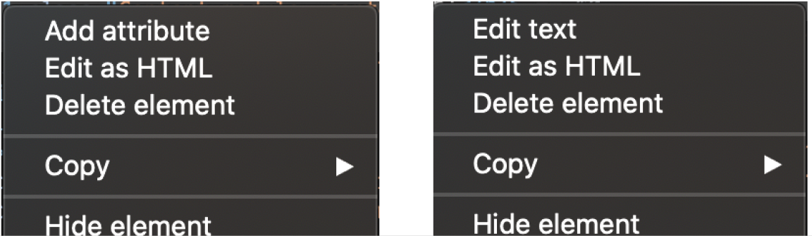

One can edit HTML of the page using devtools. [Open devtools](/posts/chromedevtool-open) and goto `Elements` tab (default tab). 

Chrome previews changes in `Element` section on the fly.
Chrome will also highlight portions of the page that corresponds to the HTML node that you are currently being hovered.

Simply, pick the element node to make changes. Right clicking on element node will show up options for the particular selection.
If you right click on contents of the node, you will get options to edit text, edit HTML, etc.
And if you right click on node itself, you will get options to edit attribute, add attribute, etc.

Simple choose the desired command and edit the section. Chrome will update the page with those changes. But only for you, it wont make actual changes to side for everyone, Obviously!

Actions can also performed via keyboard shortcuts.

- Toggle Edit Attributes mode on the currently-selected element  - `Enter` 
- Select the next / previous attribute after entering Edit Attributes mode -  `Tab` / `Shift+Tab` 
- Hide the currently-selected element - `H`
- Toggle Edit as HTML mode on the currently-selected element - `F2`

Source - [Chrome Devtools Shortcut](https://developers.google.com/web/tools/chrome-devtools/shortcuts)

---