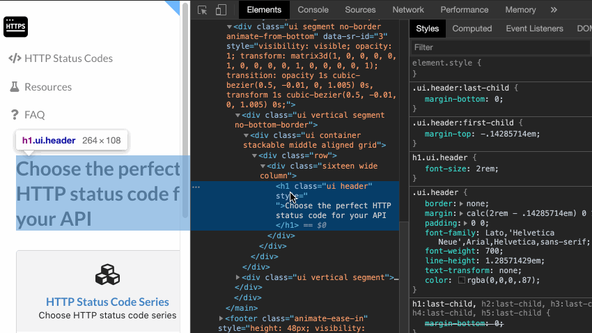
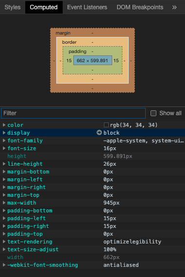

Just like [editing HTML](/posts/chromedevtool-edithtml), CSS can also be edited in devtool.
Chrome will also reflect those changes on the page.

Please note that the changes are not saved and are available only till page changes/refreshes.

Another important panel is `Computed` css tab in Elements Tab.
It displays the effective CSS that is being applied to a Element Node.
If you have many CSS styles that are applied to a element, `Computed` panel will display the styles that are effectively applied considering all CSS precedence.
The Panel also has visualization for box model indicating Margin-Padding-Width of the element.

---
