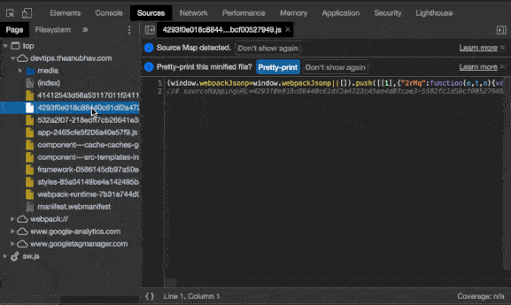

When the source file is minified, it is not human readable (for mere mortals) in "Sources" tab of Chrome dev-tools. Chrome provides a way to help you out in such scenarios.

You can make it legible by using **PrettyPrint** `{}` icon just below. You may also find `Pretty Print` Button shown on top of the file, to perform the same functionality. It transforms the current file into human-readable form.

**Pretty Print** or **Format** options only un-minifies the source file. It does not help in tackling uglification/obfuscation of code. To achieve those, source maps (if available) can also be used.

- **Minification** is the act of removing all the unnecessary white spaces and redundant optional tokens to achieve performance gains.
- **Uglification** is the act of transforming the code into an "unreadable" form, that is, renaming variables/functions to hide the original intent.
- **Obfuscation** is deliberate act of creating source or machine code that is difficult for humans to understand. Programmers may intentionally obfuscate code to conceal its purpose.
---
