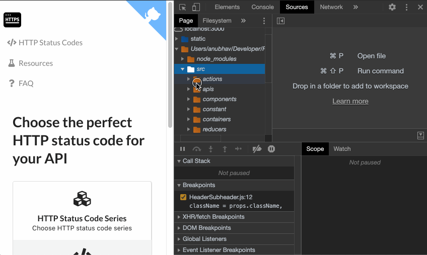

You can use the tree browser on left panel of sources tab to get to particular file (like in most IDEs).

 You can access a file using file search option. To get file search option, click on three vertical dots -> `Open File` and a search panel will open up. It will also list down recently opened files. Start typing the desired filename and it will suggest you.

You can get the file search option using keyboard shortcut as well. In `Sources` tab, use `Cmd + P` on Mac and `Ctrl + P` on PC to get file search dialog.

---
