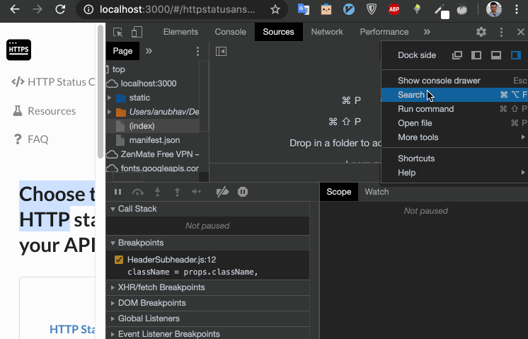

You can use the search panel to find keywords across files that may be useful to debug.

You can access a search using `Search` option. To get to search option, click on three vertical dots -> `Search` and a search panel will open up at bottom. It will also list down recently searched keywords. Start typing the desired keywords and chrome will search for the keyword across all loaded resources.

You can get the file search option using keyboard shortcut as well. In `Sources` tab, use `Cmd+Opt+F` on Mac or `Control+Shift+F` on PC to get file search dialog.

To search for a keyword in currently opened file, Hit `Command+F` on Mac or `Control+F` on PC. 

---
