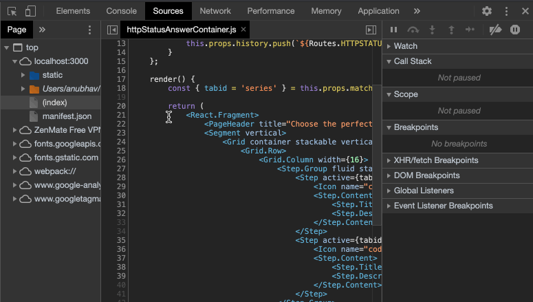

You can mark a breakpoint in the code, simply, by clicking on the line-number in the file. A prominent red dot would appear against it.
When the line is executed again, either by refreshing the page or via triggering it through same event(eg, mouse click), the breakpoint would be hit and the code can be furthur debugged.

**Basic breakpoint debug buttons**

There are buttons for tracing code at the top of the right panel.

 – `Pause/Resume`: continue the execution, hotkey F8.

Resumes the code execution to the next breakpoint. If there are no furthur breakpoints the code executes as if there was no breakpoint.

 – `Step`: run the next command, hotkey F9.

Run the next statement. It will step through all script statements one by one.

 – `Step over`: run the next command, but don’t go into a function, hotkey F10.
`Step over` executes the nested function call , skipping the function internals.

The execution is then paused immediately after that function.

 – `Step into`, hotkey F11.
That’s like `Step`, but behaves in different way in case of asynchronous function calls.  

 – `Step out`: continue the execution, hotkey Shift+F11.

Continue the execution till the end of the current function. It is useful when you are in a function but is of no interest and we want to continue to its end as soon as possible.

 – `Deactivate breakpoints`
"Enable" will turn on breakpoints to be hit, "Disable" will temporarily turn off all breakpoints.

 – `pause one exceptions`
When enabled, and the developer tools is open, a script error automatically pauses the execution. 

## Goto Line number

You can jump to exact line in the file using the `Open File` dialog (CMD + O on mac or Ctrl + O on PC). Begin the search with ":" like ":22:10" where 22 is row line and 10 is column. Even ":22" works, with row line number.

---
