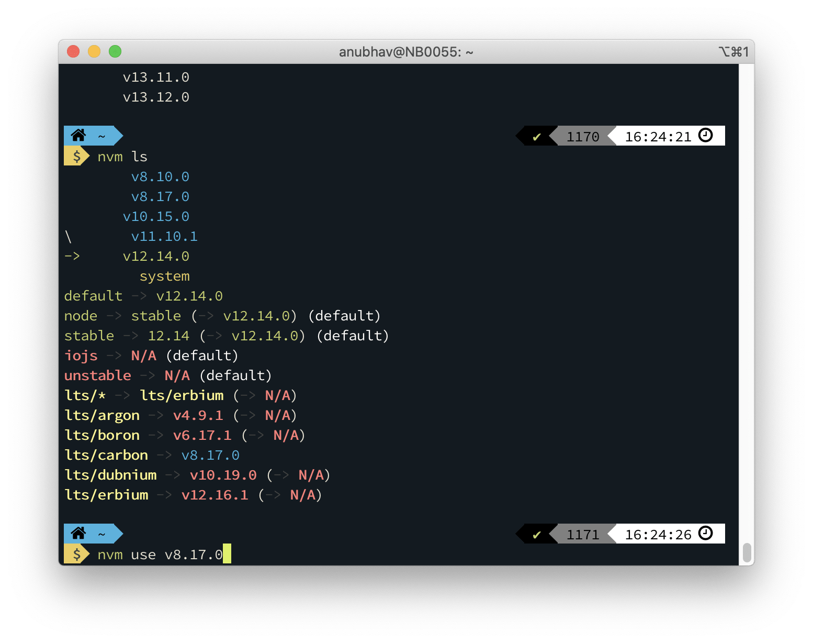

 
NVM is the easiest and effective tool to switch between multiple versions of Node. Node versions are something that we don't care about every time but when they become the problem, they are hard times!

If you have a situation like mine where I want to use the latest node version for my new projects, on the other hand I have to use a specific node version for enterprise applications that are running on (like amazon lambda supports upto one node version). 

[NVM](https://github.com/nvm-sh/nvm) is the goto tool for conquering manual version control on your machine for node.
vm works on any POSIX-compliant shell (sh, dash, ksh, zsh, bash), in particular on these platforms: unix, macOS, and windows WSL.

You can check the installation and usage instructions [here](https://github.com/nvm-sh/nvm). For windows user, there is port of nvm that supports windows, called [nvm-windows](https://github.com/coreybutler/nvm-windows)

Node Version Manager makes it super easy to do this from the command line. From setting up to actual use, NVM is simple, and it makes development in whatever version of Node.js that’s required.

NVM is designed to be installed per-user, and invoked per-shell. So you can open multiple shells/terminals and use different versions of the same.

One thing to note is global packages installed goes to individual node version folders. Like, if using v8.10 you install "eslint" globally, then eslint will only be available (as cli) when you are using v8.10. This is because the installation of global modules goes to a dedicated folder of node, and is not shared.

Official Repo: [NVM](https://github.com/nvm-sh/nvm)

---
