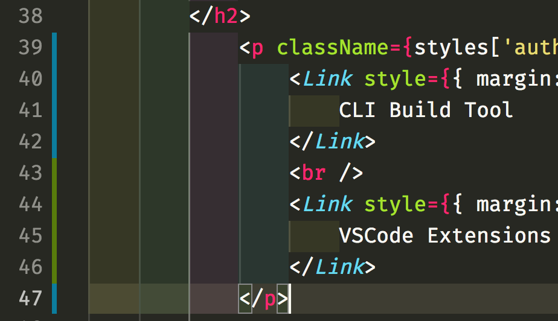

Indent rainbow is a simple extension that makes indentation more readable by colorizing each tab indentation.

Just head to [VS Code Marketplace](https://marketplace.visualstudio.com/items?itemName=oderwat.indent-rainbow) and install the extension. Period.

This extension colorizes the indentation in front of your text alternating four different colors on each step. Some may find it helpful in writing code for Nim or Python.
By default it comes with a “rainbow” of colors, but if you prefer something more subtle like me, simply past the following configuration into your User Settings. Refer its documentation [here](https://marketplace.visualstudio.com/items?itemName=oderwat.indent-rainbow)

These colors work great with the default VSCode theme and seamlessly blend in the default VSCode color scheme.

Official Repo: [Indent-Rainbow](https://github.com/oderwat/vscode-indent-rainbow)

---
