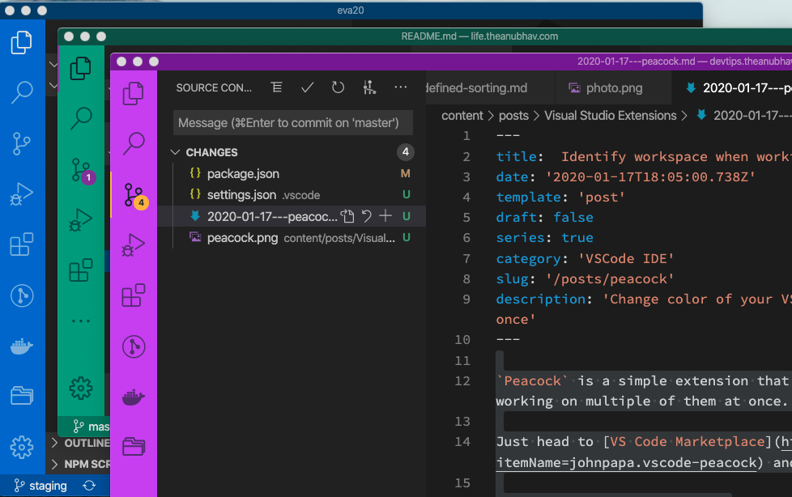

`Peacock` is a simple extension that lets you identify individual projects when working on multiple of them at once. 

Just head to [VS Code Marketplace](https://marketplace.visualstudio.com/items?itemName=johnpapa.vscode-peacock) and install the extension.

This extension colorizes the workspace(border) with a unique color to pinpoint the exact project you want to switch to when working on multiple VS code workspace. As described by the project, "Subtly change the color of your Visual Studio Code workspace. Ideal when you have multiple VS Code instances, use VS Live Share, or use VS Code's Remote features, and you want to quickly identify your editor."

After installation just switch to the workspace and use command palette options, "Surprise Me with Random color" or "Change to a favorite color" to give amazing color to current project. It saves your color preference in `.vscode` folder settings of the workspace, so that the same color comes into effect when you reopen the same workspace. 

Refer its documentation [here](https://marketplace.visualstudio.com/items?itemName=johnpapa.vscode-peacock)

These colors work great with the default VSCode theme and seamlessly blend in the default VSCode.

Official Repo: [Peacock](https://github.com/johnpapa/vscode-peacock) by John Papa

---
